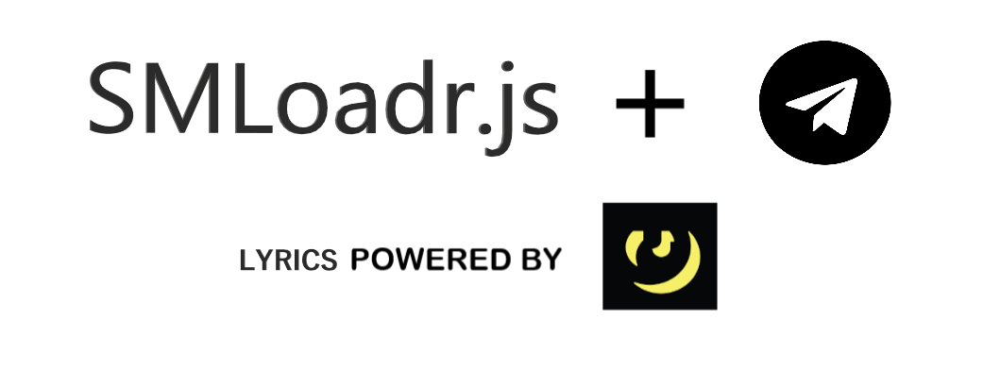

This bot is built on top of the TgFancy framework - a neat and simple Node.Js framework to interact with telegram's bot api. Uses the genius api and scrapes results to send lyrics and also integrates the [SMLoadr.js](https://github.com/mrmazakblu/SMLoader)module for its download song feature. All logs are sent to a firebase backend.

## Usage

#### Initialization

Place your arl cookie in the SMLoadrConfig.json file or simply run ```node SMLoadr.js``` in the command line for a wizard option. Make sure you have stored the configuration json inside the **database.js** found in the root directory. Once done with these, place your bot token in the **listeners.js** and everything should be fine.

#### Deployment

The version of SMLoadr.js used in this project has core dependencies of the node 12.x.x version. Make sure the package.json reads so before deployment or unintended bugs might follow.

Running this line should start up the service and have it listen for incoming queries.

```npm install && npm start```.

If you have any suggestions or want to contribute to this project, open up an issue and I'll place you in the authors file.